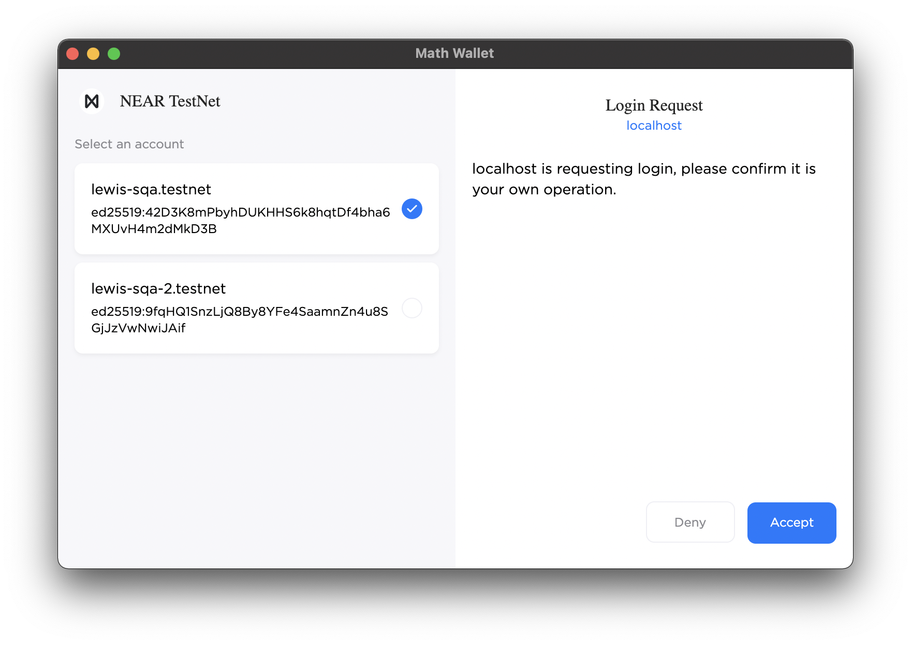

# Wallets

## Summary

Standard interfaces for wallets to maintain a consistent dApp experience.

## Motivation

After working with various wallets such as Sender and Math Wallet, it's clear the lack of a standard has made it difficult for dApps to support more than one wallet.

## Terminology

- **Signed in**: The state of whether a dApp has access to one or more accounts in the form of `FunctionCall` access keys.

## Injected Wallets

Injected wallets are browser extensions that implement the `Wallet` API (see below) via `window.near` where dApps can determine which wallet is available by inspecting the `id` property.

> Note: It's difficult to overlook the drawback of having a single namespace for wallets (even if Ethereum does this). Users must disable other wallets to avoid conflicts. Maybe `window.near` should be `Record<string, Wallet>`. This approach solves the problem of detecting which wallet(s) are available and supports multiple injected wallets simultaneously! 

### Wallet API

At it's most basic, the Wallet API has main two features:

- `request`: Communication with the wallet.
- `on` and `off`: Subscribe to notable events such as account updates.

The decision to implement `request` instead of dedicated methods means wallets can define their own custom functionality without polluting the top-level namespace. The purpose of this spec is to define the minimum set of methods to be considered an official NEAR injected wallet. Wallets are free to innovate with functionality they believe could eventually become part of the spec such as querying the locked status.

Heavily inspired by [Ethereum's JSON-RPC Methods](https://docs.metamask.io/guide/rpc-api.html#ethereum-json-rpc-methods), below is a high-level overview of what an injected wallet should look like.

```ts
import { providers } from "near-api-js";

interface Account {
  accountId: string;
  publicKey: string;
}

interface Network {
  networkId: string;
  nodeUrl: string;
}

interface SignInParams {
  contractId: string;
  methodNames?: Array<string>;
}

interface SignAndSendTransactionParams {
  signerId?: string;
  receiverId: string;
  // NEAR Actions (plain objects). See "Actions" section for details.
  actions: Array<Action>;
}

interface Transaction {
  signerId?: string;
  receiverId: string;
  // NEAR Actions (plain objects). See "Actions" section for details.
  actions: Array<Action>;
}

interface SignAndSendTransactionsParams {
  transactions: Array<Transaction>;
}

interface Methods {
  getAccounts: {
    params: {
      method: "getAccounts";
    };
    response: Array<Account>;
  };
  getNetwork: {
    params: {
      method: "getNetwork";
    };
    response: Network;
  };
  signIn: {
    params: {
      method: "signIn";
      params: SignInParams;
    };
    response: Array<Account>;
  };
  signOut: {
    params: {
      method: "signOut";
    };
    response: void;
  };
  signAndSendTransaction: {
    params: {
      method: "signAndSendTransaction";
      params: SignAndSendTransactionParams;
    };
    response: providers.FinalExecutionOutcome;
  };
  signAndSendTransactions: {
    params: {
      method: "signAndSendTransactions";
      params: SignAndSendTransactionsParams;
    };
    response: Array<providers.FinalExecutionOutcome>;
  };
}

interface Events {
  accountsChanged: { accounts: Array<Account> };
};

type Unsubscribe = () => void;

interface Wallet {
  id: string;
  request<
    MethodName extends keyof Methods,
    Method extends Methods[MethodName]
  >(
    params: Method["params"]
  ): Promise<Method["response"]>;
  on<EventName extends keyof Events>(
    event: EventName,
    callback: (params: Events[EventName]) => void
  ): Unsubscribe;
  off<EventName extends keyof Events>(
    event: EventName,
    callback?: () => void
  ): void;
}
```

### Request Methods

- `getAccounts`: Get accounts exposed to dApp. An empty list of accounts means we aren't signed in.
- `getNetwork`: Get the currently selected network.
- `signIn`: Request access to one or more accounts.
- `signOut`: Remove access to all accounts.
- `signAndSendTransaction`: Sign and Send one or more NEAR Actions.
- `signAndSendTransactions`: Sign and Send one or more NEAR Transactions.

### Events

- `accountsChanged`: Triggered whenever accounts are updated (e.g. calling `signIn` and `signOut`).

### Actions

Below are the 8 NEAR Actions used for signing transactions. Plain objects have been used to remove an unnecessary dependency on `near-api-js`.

```ts
interface CreateAccountAction {
  type: "CreateAccount";
}

interface DeployContractAction {
  type: "DeployContract";
  params: {
    code: Uint8Array;
  };
}

interface FunctionCallAction {
  type: "FunctionCall";
  params: {
    methodName: string;
    args: object;
    gas: string;
    deposit: string;
  };
}

interface TransferAction {
  type: "Transfer";
  params: {
    deposit: string;
  };
}

interface StakeAction {
  type: "Stake";
  params: {
    stake: string;
    publicKey: string;
  };
}

type AddKeyPermission =
  | "FullAccess"
  | {
      receiverId: string;
      allowance?: string;
      methodNames?: Array<string>;
    };

interface AddKeyAction {
  type: "AddKey";
  params: {
    publicKey: string;
    accessKey: {
      nonce?: number;
      permission: AddKeyPermission;
    };
  };
}

interface DeleteKeyAction {
  type: "DeleteKey";
  params: {
    publicKey: string;
  };
}

interface DeleteAccountAction {
  type: "DeleteAccount";
  params: {
    beneficiaryId: string;
  };
}

type Action =
  | CreateAccountAction
  | DeployContractAction
  | FunctionCallAction
  | TransferAction
  | StakeAction
  | AddKeyAction
  | DeleteKeyAction
  | DeleteAccountAction;
```

### Examples

**Sign in to the wallet**

```ts
const accounts = await window.near.request({
  method: "signIn",
  params: { contractId: "guest-book.testnet" }
});
```

**Get accounts (after previously calling `signIn`)**

```ts
const accounts = await window.near.request({
  method: "getAccounts"
});
```

**Subscribe to account changes**

```ts
await window.near.on("accountsChanged", (accounts) => {
  console.log("Accounts Changed", accounts);
});
```

**Get network configuration**

```ts
const network = await window.near.request({ 
  method: "getNetwork" 
});
```

**Sign and send a transaction**

```ts
const result = await window.near.request({
  method: "signAndSendTransaction",
  params: {
    signerId: "test.testnet",
    receiverId: "guest-book.testnet",
    actions: [{
      type: "FunctionCall",
      params: {
        methodName: "addMessage",
        args: { text: "Hello World!" },
        gas: "30000000000000",
        deposit: "10000000000000000000000",
      },
    }]
  }
});
```

## Sign In

The purpose of signing in to a wallet is to give dApps access to one or more accounts using `FunctionCall` access keys. When the sign in flow is triggered, the user will be prompted with an interface similar to this example taken from Math Wallet:



The list of accounts to select are those that have been imported previously. The user can choose a subset of these accounts to expose to the dApp.

### Considerations

- If there's only one imported account, the flow can be simplified to an approval prompt to sign in with the only account.
- If there are problems with the `AddKey` action for any account, we should continue unless none were successful. In the event where only a subset of the selected accounts were signed in, the dApp can call `signIn` again so the user can modify the list (remove existing accounts and/or add new ones).

### Multiple Accounts

An important concept of this architecture is dApps have access to multiple accounts. This might seem confusing at first because why would a dApp want to sign transactions with multiple accounts? The idea is the dApp might still maintain the concept of a single "active" account, but users won't need to sign in and out of accounts each time. The dApp can just display a switcher and sign transactions with new account without having to further prompt the user, thus improving the UX flow.

## Bridge Wallets (i.e. WalletConnect)

Bridge wallets such as [WalletConnect](https://docs.walletconnect.com/2.0/) enable an architecture that decouples dApps from directly interacting with a wallet by using a relay (HTTP/WebSocket) server. The benefit to this is dApp users can sign transactions using wallets that aren't necessarily located in the same place as the dApp. For example signing a transaction on the desktop using a wallet on a mobile device.

### Challenges

It's important that an integration between NEAR and WalletConnect combines the native features of both platforms without compromising on their core concepts.

Basing an approach on other platforms such as Ethereum would simply require two methods: `signAndSendTransaction` and `signAndSendTransactions`. The session state from WalletConnect allows dApps to reference the available accounts to populate the `signerId` for each transaction. Wallets can use `FullAccess` key(s) to carry out signing while cross-referencing the accounts a session has access to. The consequence of this approach is we aren't leveraging the permission model built into NEAR at the blockchain level using `FunctionCall` access keys.

The approach detailed below attempts to solve these challenges with two additional methods: `near_signIn` and `near_signOut`. The purpose of these methods is to handle the lifecycle of dApps that want to leverage `FunctionCall` access keys to reduce the frequency of prompts (i.e. gas-only `FunctionCall` actions). This means:

- The dApp "owns" the `FunctionCall` access key.
- The dApp can sign transactions locally (without WalletConnect) when they match the permissions of the access key.
- The user can revoke the access key without WalletConnect.

### JSON-RPC Methods

**near_signIn**

Request access (via `FunctionCall` access keys) to one or more accounts.

```ts
interface Account {
  accountId: string;
  publicKey: string;
}

interface SignInRequest {
  id: 1;
  jsonrpc: "2.0";
  method: "near_signIn";
  params: {
    contractId: string;
    methodNames?: Array<string>;
  };
}

interface SignInResponse {
  id: 1;
  jsonrpc: "2.0";
  result: Array<Account>;
}
```

**near_signOut**

Remove access (via `FunctionCall` access keys) to one or more accounts.

```ts
interface SignOutRequest {
  id: 1;
  jsonrpc: "2.0";
  method: "near_signOut";
  params: {};
}

interface SignOutResponse {
  id: 1;
  jsonrpc: "2.0";
  result: null;
}
```

**near_getAccounts**

Retrieve accounts with `FunctionCall` access.

```ts
interface Account {
  accountId: string;
  publicKey: string;
}

interface GetAccountsRequest {
  id: 1;
  jsonrpc: "2.0";
  method: "near_getAccounts";
  params: {};
}

interface GetAccountsResponse {
  id: 1;
  jsonrpc: "2.0";
  result: Array<Account>;
}
```

**near_signAndSendTransaction**

```ts
import { providers } from "near-api-js";

interface Transaction {
  signerId?: string;
  receiverId: string;
  // NEAR Actions (plain objects). See "Actions" section for details.
  actions: Array<Action>;
}

interface SignAndSendTransactionRequest {
  id: 1;
  jsonrpc: "2.0";
  method: "near_signAndSendTransaction";
  params: {
    transaction: Transaction;
  };
}

interface SignAndSendTransactionResponse {
  id: 1;
  jsonrpc: "2.0";
  result: providers.FinalExecutionOutcome;
}
```

**near_signAndSendTransactions**

```ts
import { providers } from "near-api-js";

interface SignAndSendTransactionsRequest {
  id: 1;
  jsonrpc: "2.0";
  method: "near_signAndSendTransactions";
  params: {
    transactions: Array<Transaction>;
  };
}

interface SignAndSendTransactionsResponse {
  id: 1;
  jsonrpc: "2.0";
  result: Array<providers.FinalExecutionOutcome>;
}
```

### Flows

**Signing in**

1. dApp makes `near_signIn` request with `contractId` and optionally `methodNames`.
2. wallet receives request and generates a key pair for each account in the session.
3. wallet sends a Transaction containing an `AddKey` Action for each key pair.
4. wallet stores the newly generated key pairs securely (mapped to WalletConnect session `topicId`). 
5. wallet responds with each account and its respective public key (`FunctionCall` access key). 

**Signing out**

1. dApp makes `near_signOut` request.
2. wallet receives request and gathers each account's public key (`FunctionCall` access key).
3. wallet sends a Transaction containing a `DeleteKey` Action for each public key.
4. wallet clears stored key pairs (related to WalletConnect session `topicId`).
5. wallet responds with `null`.

**Transaction signing (gas-only `FunctionCall`)**

1. dApp makes `near_signAndSendTransaction` request.
2. wallet determines the Transaction can be signed with the `FunctionCall` access key.
3. wallet "silently" signs the transaction without need for an approval prompt.
4. wallet responds with `providers.FinalExecutionOutcome`.

**Transaction signing (elevated permission required)**

1. dApp makes `near_signAndSendTransaction` request.
2. wallet determines the Transaction can't be signed with the `FunctionCall` access key (or one doesn't exist if `near_signIn` hasn't used).
3. wallet presents approval prompt before using the account's "root" (`FullAccess` access key). 
4. wallet responds with `providers.FinalExecutionOutcome`.

**Add account(s)**

1. wallet prepares to update session by adding new account(s).
2. wallet generates a key pair for each new account.
3. wallet sends a Transaction containing an `AddKey` Action for each key pair.
4. wallet triggers `session_update` with WalletConnect client.

**Remove account(s)**

1. wallet prepares to update session by removing account(s).
2. wallet gathers the public key (`FunctionCall` access key) of each account to remove.
3. wallet sends a Transaction containing an `DeleteKey` Action for each public key.
4. wallet clears stored key pairs of each account (related to WalletConnect session `topicId`).
5. wallet triggers `session_update` with WalletConnect client.
