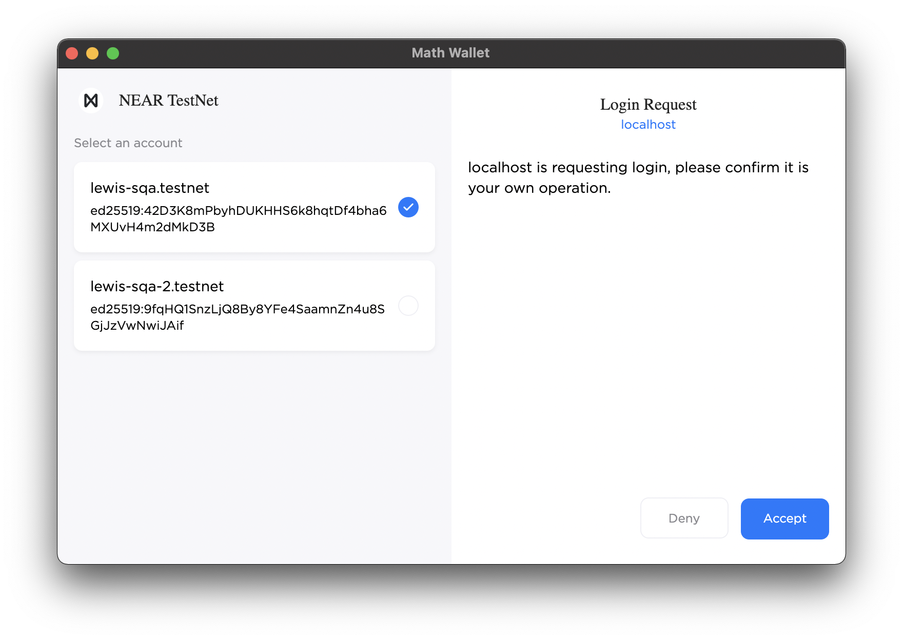

# Wallets

## Summary

TODO: What this standard is about.

## Motivation

TODO: Why we need this standard.

## Terminology

- **Connected**: The state of whether a dApp has access to one or more accounts in the form of `FunctionCall` access keys.

## Injected Wallets

Injected wallets are browser extensions that implement the `Wallet` API (see below) via `window.near` where dApps can determine which wallet is available by inspecting the `id` property.

> Note: It's difficult to overlook the drawback of having a single namespace for wallets (even if Ethereum does this). Users must disable other wallets to avoid conflicts. Maybe `window.near` should be `Record<string, Wallet>`. This approach solves the problem of detecting which wallet(s) are available and supports multiple injected wallets simultaneously! 

### Wallet API

At it's most basic, the Wallet API has main two features:

- `request`: Communication with wallet.
- `on` and `off`: Subscribe to notable events such as account updates.

The decision to implement `request` instead of dedicated methods means wallets can define their own custom functionality without polluting the top-level namespace. The purpose of this spec is to define the minimum set of methods to be considered an official NEAR injected wallet. Wallets are free to innovate with functionality they believe could eventually become part of the spec such as querying the locked status.

Heavily inspired by [Ethereum's JSON-RPC Methods](https://docs.metamask.io/guide/rpc-api.html#ethereum-json-rpc-methods), below is a high-level overview of what an injected wallet should look like.

```ts
import { providers } from "near-api-js";

interface Account {
  accountId: string;
}

interface KeyPair {
  publicKey: string;
  privateKey: string;
}

interface ConnectedAccount extends Account {
  // Key pair related to the underlying FunctionCall access key.
  keyPair: KeyPair;
}

interface Network {
  networkId: string;
  nodeUrl: string;
}

interface ConnectParams {
  contractId: string;
  methodNames?: Array<string>;
  maxAccounts?: number;
}

interface SignAndSendTransactionParams {
  signerId?: string;
  receiverId: string;
  // NEAR Actions (plain objects). See "Actions" section for details.
  actions: Array<Action>;
}

interface Transaction {
  signerId?: string;
  receiverId: string;
  // NEAR Actions (plain objects). See "Actions" section for details.
  actions: Array<Action>;
}

interface SignAndSendTransactionsParams {
  transactions: Array<Transaction>;
}

interface Methods {
  getAccounts: {
    params: {
      method: "getAccounts";
    };
    response: Array<Account>;
  };
  getNetwork: {
    params: {
      method: "getNetwork";
    };
    response: Network;
  };
  connect: {
    params: {
      method: "connect";
      params: ConnectParams;
    };
    response: Array<ConnectedAccount>;
  };
  disconnect: {
    params: {
      method: "disconnect";
    };
    response: void;
  };
  signAndSendTransaction: {
    params: {
      method: "signAndSendTransaction";
      params: SignAndSendTransactionParams;
    };
    response: providers.FinalExecutionOutcome;
  };
  signAndSendTransactions: {
    params: {
      method: "signAndSendTransactions";
      params: SignAndSendTransactionsParams;
    };
    response: Array<providers.FinalExecutionOutcome>;
  };
}

interface Events {
  accountsChanged: { accounts: Array<Account> };
};

type Unsubscribe = () => void;

interface Wallet {
  id: string;
  request<
    MethodName extends keyof Methods,
    Method extends Methods<MethodName>
  >(
    params: Method["params"]
  ): Promise<Method["response"]>;
  on<EventName extends keyof Events>(
    event: EventName,
    callback: (params: Events<EventName>) => void
  ): Unsubscribe;
  off<EventName extends keyof Events>(
    event: EventName,
    callback?: () => void
  ): void;
}
```

### Request Methods

- `getAccounts`: Get accounts exposed to dApp. An empty list of accounts means we aren't connected.
- `getNetwork`: Get the currently selected network.
- `connect`: Request access to one or more accounts.
- `disconnect`: Remove access to all accounts.
- `signAndSendTransaction`: Sign and Send one or more NEAR Actions.
- `signAndSendTransactions`: Sign and Send one or more NEAR Transactions.

### Events

- `accountsChanged`: Triggered whenever accounts are updated (e.g. calling `connect` and `disconnect`).

### Actions

Below are the 8 NEAR Actions used for signing transactions. Plain objects have been used to remove an unnecessary dependency on `near-api-js`.

```ts
interface CreateAccountAction {
  type: "CreateAccount";
}

interface DeployContractAction {
  type: "DeployContract";
  params: {
    code: Uint8Array;
  };
}

interface FunctionCallAction {
  type: "FunctionCall";
  params: {
    methodName: string;
    args: object;
    gas: string;
    deposit: string;
  };
}

interface TransferAction {
  type: "Transfer";
  params: {
    deposit: string;
  };
}

interface StakeAction {
  type: "Stake";
  params: {
    stake: string;
    publicKey: string;
  };
}

type AddKeyPermission =
  | "FullAccess"
  | {
      receiverId: string;
      allowance?: string;
      methodNames?: Array<string>;
    };

interface AddKeyAction {
  type: "AddKey";
  params: {
    publicKey: string;
    accessKey: {
      nonce?: number;
      permission: AddKeyPermission;
    };
  };
}

interface DeleteKeyAction {
  type: "DeleteKey";
  params: {
    publicKey: string;
  };
}

interface DeleteAccountAction {
  type: "DeleteAccount";
  params: {
    beneficiaryId: string;
  };
}

type Action =
  | CreateAccountAction
  | DeployContractAction
  | FunctionCallAction
  | TransferAction
  | StakeAction
  | AddKeyAction
  | DeleteKeyAction
  | DeleteAccountAction;
```

### Examples

**Connect to the wallet**

```ts
const accounts = await window.near.request({
  method: "connect",
  params: { contractId: "guest-book.testnet" }
});
```

**Get accounts (exposed via `connect`)**

```ts
const accounts = await window.near.request({
  method: "getAccounts"
});
```

**Subscribe to account changes**

```ts
await window.near.on("accountsChanged", (accounts) => {
  console.log("Accounts Changed", accounts);
});
```

**Get network configuration**

```ts
await window.near.request({ method: "getNetwork" });
```

**Sign and send a transaction**

```ts
const result = await window.near.request({
  method: "signAndSendTransaction",
  params: {
    signerId: "test.testnet",
    receiverId: "guest-book.testnet",
    actions: [{
      type: "FunctionCall",
      params: {
        methodName: "addMessage",
        args: { text: "Hello World!" },
        gas: "30000000000000",
        deposit: "10000000000000000000000",
      },
    }]
  }
});
```

## Bridge Wallets (i.e. WalletConnect)

TODO: Description

### Flows

**Connecting**

1. Create pairing and session (with no `FunctionCall` access to accounts).
2. Call `near_connect` to gain access to one or more accounts (via `FunctionCall` access keys). This will update the session `accounts` state.
3. Store key pair(s) locally to enable signing without WalletConnect for gas-only `FunctionCall` Actions.

**Transaction signing (gas-only `FunctionCall`)**

1. Determine permissions required for transaction(s).
2. Retrieve key pair(s) locally for account id(s).
3. Sign and send transaction(s) within the dApp (no need to use WalletConnect session).

**Transaction signing (elevated permission)**

1. Determine permissions required for transaction(s).
2. Call `near_signAndSendTransaction` (or `near_signAndSendTransactions`) for transaction(s) that don't match the `FunctionCall` access key permissions.

**Update accounts (wallet)**

1. Delete `FunctionCall` access keys of each deselected account. Adding new accounts is not supported (unable to send key pairs to dApp).
2. Trigger WalletConnect session update.

**Update accounts (dApp)**

1. Call `near_connect` to reconfigure account access. This will update the session `accounts` state.

### JSON-RPC Methods

**near_connect**

Request access (via `FunctionCall` access keys) to one or more accounts. Private keys are returned to enable local signing 

```ts
interface ConnectRequest {
  id: 1;
  jsonrpc: "2.0";
  method: "near_connect";
  params: {
    contractId: string;
    methodNames?: Array<string>;
    maxAccounts?: number;
  };
}

interface Account {
  accountId: string;
}

interface KeyPair {
  publicKey: string;
  privateKey: string;
}

interface ConnectedAccount extends Account {
  // Key pair related to the underlying FunctionCall access key.
  keyPair: KeyPair;
}

interface ConnectResponse {
  id: 1;
  jsonrpc: "2.0";
  result: Array<ConnectedAccount>;
}
```

**near_signAndSendTransaction**

```ts
import { providers } from "near-api-js";

interface SignAndSendTransactionRequest {
  id: 1;
  jsonrpc: "2.0";
  method: "near_signAndSendTransaction";
  params: {
    signerId?: string;
    receiverId: string;
    // NEAR Actions (plain objects). See "Actions" section for details.
    actions: Array<Action>;
  };
}

interface SignAndSendTransactionResponse {
  id: 1;
  jsonrpc: "2.0";
  result: providers.FinalExecutionOutcome;
}
```


**near_signAndSendTransactions**

```ts
import { providers } from "near-api-js";

interface SignAndSendTransactionsRequest {
  id: 1;
  jsonrpc: "2.0";
  method: "near_signAndSendTransactions";
  params: {
    transactions: Array<Transaction>;
  };
}

interface Transaction {
  signerId?: string;
  receiverId: string;
  // NEAR Actions (plain objects). See "Actions" section for details.
  actions: Array<Action>;
}

interface SignAndSendTransactionsResponse {
  id: 1;
  jsonrpc: "2.0";
  result: Array<providers.FinalExecutionOutcome>;
}
```

### Challenges

It's important that an integration between NEAR and WalletConnect combines the native features of both platforms without compromising on their core concepts.

Basing our implementation on other platforms such as Ethereum means only `signAndSendTransaction` and `signAndSendTransactions` are needed. The idea with this approach is accounts are referenced in the WalletConnect session and the wallet will use `FullAccess` keys to sign the transaction(s). While this works well with WalletConnect, the downside is it skips over a fundamental concept in NEAR, `FunctionCall` access keys.

Access Keys enable permissions at a blockchain-level and can be revoked at any point. Using `FullAccess` keys effectively skips over this feature. It's best practice to use `FunctionCall` access keys where possible to reduce the frequency of prompts and increase security - we should only "step up" to `FullAccess` keys for Actions that need it.

The approach detailed above for WalletConnect and NEAR attempts to solve these challenges with a new method, `near_connect`. The purpose of this method is to request access to one or more accounts in the form of `FunctionCall` access keys. This means:

- The dApp "owns" the `FunctionCall` access key.
- The dApp can sign transactions locally (without WalletConnect) that match the permissions of the access key.
- The user can revoke the access key without WalletConnect.

The difficulty with this approach is trying to sync the WalletConnect accounts state with the accounts we have `FunctionCall` access keys for. I originally planned for a `near_getAccounts` which would also return the `keyPair` but I've since questioned the security implications of exposing key pairs like this. `near_connect` on the other hand requires confirmation from the wallet before returning this information. Without `near_getAccounts` we're unable to handle new accounts added to the session from the wallet side.

## Connecting

The purpose of connecting to a wallet is to give dApps access to one or more accounts - backed by `FunctionCall` access keys. When the Connect flow is triggered, the user will be prompted with an interface similar to this example taken from Math Wallet:



The list of accounts to select are those that have been imported previously. The user can choose a subset of these accounts to expose to the dApp.

### Considerations

- If there's only one imported account, the flow can be simplified to an approval prompt to connect with the only account.
- If there are problems with the `AddKey` action for any account, we should continue unless none were successful. In the event where only a subset of the selected accounts were connected, the dApp can call `connect` again so the user can modify the list (remove existing accounts and/or add new ones).
- If the dApp would like to restrict the number of accounts (e.g. only one) a user can select, they can pass a `maxAccounts` parameter for the `connect` request method.

### Multiple Accounts

An important concept of this architecture is dApps have access to multiple accounts. This might seem confusing at first because why would a dApp want to sign transactions with multiple accounts? The idea is the dApp might still maintain the concept of a single "active" account, but users won't need to sign in and out of accounts each time. The dApp can just display a switcher and sign transactions with new account without having to further prompt the user, thus improving the UX flow.

TODO: Add references/images around existing wallets and how they have multiple accounts internally, but only expose a single "active" account.

TODO: Talk about how WalletConnect has first-class support for this functionality.

TODO: Reference Ethereum APIs where they also return a list of accounts (though MetaMask always returns an array with one address).

### Locked Status

TODO: Talk about what it means for a wallet to be locked. What you can access etc. 
